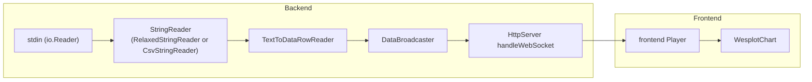

# Wesplot Architecture

## High-level architecture and data flow

The current data pipeline is summarized in the following diagram:

### Key files

- `cmd/main.go`: Program entry point
- `data_reader.go`: Data parsing and conversion
- `data_broadcaster.go`: Buffering, thread-safe multi-channel (multi-websocket) handling.
- `http_server.go`: Actually defining the HTTP endpoints.
- `frontend/`: a Vite vanilla TypeScript application

## Backend data handling

Wesplot should be able to mirror the data it is receiving to multiple browser tabs, through multiple websocket connections. This is done by the `DataBroadcaster` in [data_broadcaster.go](./data_broadcaster.go), which is the most central part of this code. This is a single goroutine that takes the input data and mirrors it across multiple registered channels, one for each websocket connection.

Each time a websocket connection is created, a goroutine is spawned to handle it (see `handleWebSocket` in [http_server.go](./http_server.go)). A new channel is created for this websocket, which is registered and stored with the `DataBroadcaster` until the websocket connection closes. The websocket connection goroutine runs alongside the `DataBroadcaster` goroutine and communicates across this channel. The `DataBroadcaster`, upon the arrival of an input data, will cache the data in a ring buffer and broadcast to each registered channel (`cacheAndBroadcastData`). On channel registration, the ring buffer data will be pushed to the newly registered channel. The detailed thread safety is documented in the comments of `RegisterChannel`.

The data is flushed to the frontend in websocket handling goroutine periodically to avoid overloading the frontend with websocket messages. This is controlled by the `flushInterval` parameter.
