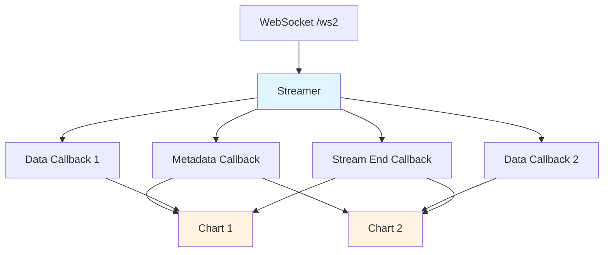

## Frontend Architecture (v2)

The v2 frontend (entrypoint: `v2.html`) uses the binary `/ws2` endpoint and supports multi-series with independent X values. The architecture prioritizes **simplicity, performance, and testability** with vanilla JavaScript/TypeScript.

### Design Principles

1. **Separation of Concerns:** Streaming logic (Streamer) is decoupled from rendering logic (Chart)
2. **Zero-Copy Data Transfer:** Pass TypedArray references directly from binary messages to avoid copying
3. **Callback-Based Communication:** Streamer notifies Charts via registered callbacks
4. **Vanilla JS First:** No framework dependencies, pure TypeScript/JavaScript
5. **Performance:** Minimize allocations, batch updates, reuse buffers

### Component Overview



### Streamer Component

**Responsibility:** Manage WebSocket connection to `/ws2`, decode binary envelope protocol, dispatch data to registered callbacks.

**File:** `src/v2/streamer.ts`

**API:**

```typescript
interface StreamerCallbacks {
  onMetadata?: (metadata: Metadata) => void;
  onData?: (seriesId: number, xData: Float64Array, yData: Float64Array) => void;
  onStreamEnd?: (error: boolean, message: string) => void;
  onError?: (error: Error) => void;
}

class Streamer {
  constructor(wsUrl: string);

  // Register callbacks for stream events
  registerCallbacks(callbacks: StreamerCallbacks): void;

  // Start streaming
  connect(): Promise<void>;

  // Close connection
  disconnect(): void;

  // Connection state
  isConnected(): boolean;
}
```

**Key Behaviors:**

1. **Connection Management:**
   - Opens WebSocket to `/ws2` endpoint
   - Handles connection lifecycle (connect, disconnect, errors)

2. **Protocol Decoding:**
   - Decodes 8-byte envelope header (version, reserved, type, length)
   - Dispatches to appropriate message handler based on type
   - **Zero-copy optimization:** Wraps binary data in TypedArrays without copying

3. **Message Handling:**
   - **METADATA (0x02):** Parse JSON, invoke `onMetadata` callback
   - **DATA (0x01):** Decode SeriesID, Length, X/Y arrays
     - Create `Float64Array` views directly over WebSocket buffer (zero-copy)
     - Invoke `onData(seriesId, xArray, yArray)` callback
   - **STREAM_END (0x03):** Parse JSON, invoke `onStreamEnd` callback
   - **Unknown Types:** Log warning, continue processing

4. **Error Handling:**
   - WebSocket errors: invoke `onError` callback
   - Decoding errors: invoke `onError` callback
   - Connection closed: invoke `onStreamEnd` if not already sent

5. **Performance Optimizations:**
   - Reuse ArrayBuffer for decoding (avoid allocations)
   - Pass TypedArray views (zero-copy) to callbacks
   - Batch data messages when possible

**Data Flow:**

```
Binary WebSocket Message
  ↓
ArrayBuffer (raw bytes)
  ↓
DataView (for header parsing)
  ↓
Float64Array views over payload (zero-copy)
  ↓
onData callback (seriesId, Float64Array, Float64Array)
  ↓
Chart component
```

### Chart Component

**Responsibility:** Render a chart for one or more series, handle data updates, manage Chart.js instance.

**File:** `src/v2/chart.ts`

**API:**

```typescript
interface ChartConfig {
  container: HTMLElement;           // DOM element to render chart into
  seriesIds: number[];              // Which series to display (by index)
  metadata: Metadata;               // Stream metadata (from onMetadata)
  windowSize?: number;              // Max points to display (rolling window)
  colors?: string[];                // Series colors
}

class Chart {
  constructor(config: ChartConfig);

  // Append data to a series (called from Streamer onData callback)
  appendData(seriesId: number, xData: Float64Array, yData: Float64Array): void;

  // Handle stream end
  handleStreamEnd(error: boolean, message: string): void;

  // Update chart options (title, labels, etc.)
  updateOptions(options: Partial<WesplotOptions>): void;

  // Destroy chart and clean up resources
  destroy(): void;
}
```

**Key Behaviors:**

1. **Initialization:**
   - Creates Chart.js instance in provided container element
   - Configures chart based on metadata (labels, title, axis limits)
   - Initializes data buffers for each series (using specified `seriesIds`)

2. **Data Management:**
   - Maintains separate X/Y arrays for each series
   - Supports series with **independent X values** (no shared X assumption)
   - Implements rolling window if `windowSize` is specified
   - **Zero-copy friendly:** Copies Float64Array data into internal buffers (unavoidable for Chart.js)

3. **Rendering:**
   - Batches updates to avoid excessive redraws
   - Uses Chart.js `update()` API efficiently
   - Throttles updates for high-frequency data

4. **Multiple Series:**
   - Each Chart can display multiple series
   - Series are identified by `seriesId` (matches backend DATA messages)
   - Charts can share or partition series (e.g., Chart 1 shows series 0-1, Chart 2 shows series 2-3)

5. **Lifecycle:**
   - `appendData()`: Called by Streamer for each DATA message
   - `handleStreamEnd()`: Called when stream ends (clean termination or error)
   - `destroy()`: Clean up Chart.js instance and buffers

**Data Flow:**

```
Streamer onData callback
  ↓
Chart.appendData(seriesId, Float64Array, Float64Array)
  ↓
Copy data into internal series buffers (required by Chart.js)
  ↓
Apply rolling window if needed
  ↓
Update Chart.js data
  ↓
Batch/throttle render
  ↓
Chart.js render to canvas
```

### Main Application

**Responsibility:** Initialize Streamer and Chart(s), wire them together, handle application lifecycle.

**File:** `src/v2/main.ts`

**Flow:**

```typescript
async function main() {
  // 1. Create Streamer
  const streamer = new Streamer(`ws://${baseHost}/ws2`);

  // 2. Set up callbacks
  let metadata: Metadata;
  let chart: Chart;

  streamer.registerCallbacks({
    onMetadata: (meta) => {
      metadata = meta;

      // 3. Create Chart after metadata arrives
      chart = new Chart({
        container: document.getElementById('chart-container')!,
        seriesIds: [0, 1, 2], // Display first 3 series
        metadata: meta,
      });
    },

    onData: (seriesId, xData, yData) => {
      // 4. Forward data to Chart
      if (chart) {
        chart.appendData(seriesId, xData, yData);
      }
    },

    onStreamEnd: (error, message) => {
      // 5. Handle stream termination
      if (chart) {
        chart.handleStreamEnd(error, message);
      }
      if (error) {
        console.error('Stream error:', message);
      }
    },

    onError: (error) => {
      console.error('Streamer error:', error);
    }
  });

  // 6. Connect and start streaming
  await streamer.connect();
}
```

### Multi-Chart Support (Future)

The architecture supports multiple Chart instances easily:

```typescript
// Create multiple charts showing different series
const chart1 = new Chart({
  container: document.getElementById('chart1')!,
  seriesIds: [0, 1],  // First two series
  metadata: metadata,
});

const chart2 = new Chart({
  container: document.getElementById('chart2')!,
  seriesIds: [2, 3],  // Next two series
  metadata: metadata,
});

// Both charts receive data from same Streamer
streamer.registerCallbacks({
  onData: (seriesId, xData, yData) => {
    // Route data to appropriate chart(s)
    if (seriesId <= 1) chart1.appendData(seriesId, xData, yData);
    if (seriesId >= 2) chart2.appendData(seriesId, xData, yData);
  }
});
```

### Performance Considerations

1. **Zero-Copy Data Transfer:**
   - WebSocket binary message → ArrayBuffer
   - Float64Array view over ArrayBuffer (no copy)
   - Pass Float64Array reference to callback (no copy)
   - Chart copies data into internal buffers (unavoidable for Chart.js)

2. **Memory Management:**
   - Reuse ArrayBuffer for decoding (avoid GC pressure)
   - Rolling window limits memory usage
   - TypedArrays provide efficient numeric storage

3. **Rendering Optimization:**
   - Batch/throttle Chart.js updates (e.g., max 60 FPS)
   - Use `requestAnimationFrame` for smooth rendering
   - Avoid full chart re-renders (use incremental updates)

4. **High-Frequency Data:**
   - Buffer data messages before updating chart
   - Downsample if data rate exceeds display capacity
   - Prioritize latest data if buffer overflows

### Testing Strategy

1. **Streamer Tests:**
   - Mock WebSocket with binary test data
   - Verify protocol decoding correctness
   - Test callback invocations
   - Test error handling (malformed messages, disconnects)

2. **Chart Tests:**
   - Test data appending and rolling window
   - Test multi-series with independent X values
   - Test Chart.js integration (may require headless browser)
   - Performance tests (memory, render time)

3. **Integration Tests:**
   - End-to-end streaming with mock backend
   - Multi-chart scenarios
   - High-frequency data stress tests

### Key Differences from v1

| Aspect                  | v1 (Legacy)                     | v2 (New)                          |
|-------------------------|---------------------------------|-----------------------------------|
| **Protocol**            | JSON `/ws`                      | Binary `/ws2`                     |
| **X Values**            | Shared across all series        | Independent per series            |
| **Architecture**        | Monolithic Player + Chart       | Decoupled Streamer + Chart        |
| **Communication**       | Tight coupling                  | Callback-based                    |
| **Multi-Chart**         | Not supported                   | Fully supported                   |
| **Performance**         | JSON parsing overhead           | Zero-copy TypedArrays             |
| **Testability**         | Limited (tight coupling)        | High (decoupled components)       |

### File Structure

```
frontend/
  index.html              # v1 entrypoint (legacy)
  v2.html                 # v2 entrypoint (new)
  src/
    main.ts               # v1 main
    player.ts             # v1 Player (legacy)
    wesplot-chart.ts      # v1 Chart (legacy)
    types.ts              # Shared types
    v2/
      main.ts             # v2 main application
      streamer.ts         # Streamer component
      chart.ts            # Chart component
      protocol.ts         # Binary protocol decoder utilities
      types.ts            # v2-specific types
```
