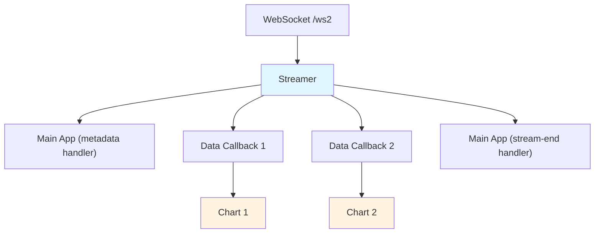

## Frontend Architecture (v2)

The v2 frontend (entrypoint: `v2.html`) uses the binary `/ws2` endpoint and supports multi-series with independent X values.

### Design Principles

1. **Separation of Concerns:** Data streaming (Streamer) is decoupled from rendering (Chart)
2. **Zero-Copy Data Transfer:** Pass TypedArray references directly from binary messages to avoid copying
3. **Callback-Based Communication:** Streamer notifies Charts via registered callbacks
4. **Vanilla JS First:** No framework dependencies, pure TypeScript/JavaScript
5. **Performance:** Minimize allocations, batch updates, reuse buffers

### Component Overview



### Streamer Component

**Responsibility:** Manage WebSocket connection to `/ws2`, decode binary envelope protocol (see [docs/development/ws-protocol.md](./ws-protocol.md)), dispatch data to registered callbacks.

**File:** `src/v2/streamer.ts`

**API:**

```typescript
interface StreamerCallbacks {
  onMetadata?: (metadata: Metadata) => void;
  // Streamer owns per-series `CircularBuffer` instances (typed for float64).
  // When dispatching data, the Streamer will produce an ordered array of
  // `Float64Array` segments for X and Y respectively. In the common case
  // the array will contain a single segment; if the circular buffer wraps
  // two segments will be provided (end then begin). Charts must treat the
  // segments as concatenated in order.
  onData?: (seriesId: number, xSegments: Float64Array[], ySegments: Float64Array[]) => void;
  onStreamEnd?: (error: boolean, message: string) => void;
  onError?: (error: Error) => void;
}

class Streamer {
  constructor(wsUrl: string, windowSize: number);

  // Register callbacks for stream events
  registerCallbacks(callbacks: StreamerCallbacks): void;

  // Unregister callbacks so they stop getting events
  unregisterCallbacks(callbacks: StreamerCallbacks): void;

  // Start streaming
  connect(): void;

  // Close connection
  disconnect(): void;

  // Connection state
  isConnected(): boolean;

  // Internals (design): per-series buffers created on-demand
  // xBuffers: Map<seriesId, CircularBuffer>  (Float64 backing)
  // yBuffers: Map<seriesId, CircularBuffer>  (Float64 backing)
  // Buffers are created when METADATA is received (based on number of series),
  // or on-demand when DATA messages arrive if METADATA hasn't been received yet.
  // The `CircularBuffer` abstraction encapsulates write position, read
  // slicing, and provides zero-copy `Float64Array` segment views for
  // dispatch (1 or 2 segments when wrapped).
}
```

**Key Behaviors:**

1. **Connection Management:**
   - Opens WebSocket to `/ws2` endpoint
   - Handles connection lifecycle (connect, disconnect, errors)

2. **Protocol Decoding:**
   - Decodes 8-byte envelope header (version, reserved, type, length)
   - Dispatches to appropriate message handler based on type
   - **Zero-copy optimization:** Wraps binary data in TypedArrays without copying

3. **Message Handling:**
   - **METADATA (0x02):** Parse JSON, create per-series `CircularBuffer` instances (one X buffer and one Y buffer for each series based on the `Columns` array length), then invoke `onMetadata` callback
   - **DATA (0x01):** Decode SeriesID, Length, X/Y arrays
     - If `Length == 0` (per protocol), treat this as a series break (discontinuity). To keep the hot path simple and zero-copy, the Streamer will append a sentinel `NaN` value into the X and Y buffers at the current write position and advance the write position by one.
     - Otherwise, append incoming data into Streamer's per-series ring buffers (owned, keyed by `seriesId`). If buffers don't exist for the seriesId (e.g., DATA arrived before METADATA), create them on-demand.
     - On dispatch, construct one or more `Float64Array` views that present the valid data in logical order. If the ring buffer did not wrap, a single contiguous view is produced; if it wrapped, two views are produced (tail then head).
     - Invoke `onData(seriesId, xSegments, ySegments)` where `xSegments` and `ySegments` are ordered arrays of `Float64Array` segments to be treated as concatenated by the consumer. The Streamer guarantees that segments are split only by buffer wrap; explicit series breaks are encoded inline as `NaN` values in the segments.
   - **STREAM_END (0x03):** Parse JSON, invoke `onStreamEnd` callback
   - **Unknown Types:** Log warning, continue processing

4. **Error Handling:**
   - WebSocket errors: invoke `onError` callback
   - Decoding errors: invoke `onError` callback
   - Connection closed: invoke `onStreamEnd` if not already sent

5. **Performance Optimizations:**
   - Reuse ArrayBuffer for decoding (avoid allocations)
   - Pass TypedArray views (zero-copy) to callbacks
   - Batch data messages when possible

**Data Flow:**

```
Binary WebSocket Message
  ↓
ArrayBuffer (raw bytes)
  ↓
DataView (for header parsing)
  ↓
Float64Array views over payload (zero-copy)
  ↓
Streamer appends payload into per-series ring buffers (Map keyed by seriesId)
  ↓
onData callback (seriesId, Float64Array[], Float64Array[])
  ↓
Chart component
```

### Chart Component

**Responsibility:** Render a chart for one or more series, handle data updates, manage Chart.js instance.

**File:** `src/v2/chart.ts`

**API:**

```typescript
interface ChartConfig {
  container: HTMLElement;           // DOM element to render chart into
  seriesIds: number[];              // Which series to display (series identifiers)
  metadata: Metadata;               // Stream metadata (from onMetadata)
  windowSize?: number;              // Max points to display (rolling window)
  colors?: string[];                // Series colors
}

class Chart {
  constructor(container: HTMLElement, config: ChartConfig);

  // Update method: Streamer forwards the owned buffer segments to the
  // chart via `update`. `update` performs a fast reference assignment of
  // the latest segments and increments an internal generation counter.
  // This is intentionally cheap and allocation-free on the hot path.
  update(seriesId: number, xSegments: Float64Array[], ySegments: Float64Array[]): void;

  // Render method: Called on animation frame. `render` checks the
  // generation counter and only rebuilds Chart.js row-oriented data and
  // calls Chart.js `update()` when the generation has changed since the
  // last render. This batches render work and avoids redrawing on every
  // incoming message.
  render(): void;

  // Handle stream end
  handleStreamEnd(error: boolean, message: string): void;

  // Update chart options (title, labels, etc.)
  updateOptions(options: Partial<WesplotOptions>): void;

  // Destroy chart and clean up resources
  destroy(): void;
}
```

**Key Behaviors:**

1. **Initialization:**
  - Creates Chart.js instance in provided container element
  - Configures chart based on metadata (labels, title, axis limits)
  - Initializes data buffers for each series (using specified `seriesIds`)

2. **Data Management:**
  - Maintains separate X/Y arrays for each series
  - Supports series with **independent X values** (no shared X assumption)
  - Implements rolling window if `windowSize` is specified
  - **Zero-copy friendly:** Copies Float64Array data into internal buffers (unavoidable for Chart.js)
  - **Series breaks:** Charts must support discontinuities. The Streamer encodes explicit breaks inline by inserting `NaN` sentinel values (in both X and Y buffers) into the segments. Chart will convert this appropriately to ChartJS such that a discontinuity is shown.

3. **Rendering:**
  - Rendering is performed on each animation frame using the latest cached data. To reduce the amount of work needed, rendering can be throttled by skipping frames as needed.

4. **Multiple Series:**
   - Each Chart can display multiple series
   - Series are identified by `seriesId` (matches backend DATA messages)
   - Charts can share or partition series (e.g., Chart 1 shows series 0-1, Chart 2 shows series 2-3)

5. **Lifecycle:**
  - `update()`: Called by Streamer (via callback) to attach the latest buffer segments to the chart and increment a generation counter (cheap, allocation-free).
  - `render()`: Called on `requestAnimationFrame`; checks the generation counter and only performs Chart.js data conversion and drawing when the generation changed since the last render.
  - `handleStreamEnd()`: Called when stream ends (clean termination or error)
  - `destroy()`: Clean up Chart.js instance and buffers

**Data Flow:**

```
Streamer onData callback
  ↓
Chart.update(seriesId, Float64Array[], Float64Array[])
  ↓
Store latest segments and increment generation counter
  ↓
On animation frame: if generation changed, convert segments to Chart.js row-oriented data, apply rolling window, and call Chart.js `update()`
```

### Main Application

**Responsibility:** Initialize Streamer and Chart(s), wire them together, handle application lifecycle.

**File:** `src/v2/main.ts`

**Flow:**

```typescript
function main() {
  // 1. Create Streamer
  const streamer = new Streamer(`ws://${baseHost}/ws2`);

  // 2. Set up callbacks
  let metadata: Metadata;
  let chart: Chart;

  streamer.registerCallbacks({
    onMetadata: (meta) => {
      metadata = meta;

      // 3. Create Chart after metadata arrives
      chart = new Chart({
        container: document.getElementById('chart-container')!,
        seriesIds: [0, 1, 2], // Display first 3 series
        metadata: meta,
      });
    },

    onData: (seriesId, xSegments, ySegments) => {
      // 4. Forward data to Chart (update with Streamer-owned buffer segments)
      if (chart) {
        chart.update(seriesId, xSegments, ySegments);
      }
    },

    onStreamEnd: (error, message) => {
      // 5. Handle stream termination
      if (chart) {
        chart.handleStreamEnd(error, message);
      }
      if (error) {
        console.error('Stream error:', message);
      }
    },

    onError: (error) => {
      console.error('Streamer error:', error);
    }
  });

  // 6. Connect and start streaming
  streamer.connect();
}
```

### Multi-Chart Support (Future)

The architecture supports multiple Chart instances easily:

```typescript
// Create multiple charts showing different series
const chart1 = new Chart({
  container: document.getElementById('chart1')!,
  seriesIds: [0, 1],  // First two series
  metadata: metadata,
});

const chart2 = new Chart({
  container: document.getElementById('chart2')!,
  seriesIds: [2, 3],  // Next two series
  metadata: metadata,
});

// Both charts receive data from same Streamer
streamer.registerCallbacks({
  onData: (seriesId, xSegments, ySegments) => {
    // Route data to appropriate chart(s) using Streamer-owned buffer segments
    if (seriesId <= 1) chart1.render(seriesId, xSegments, ySegments);
    if (seriesId >= 2) chart2.render(seriesId, xSegments, ySegments);
  }
});
```

### Performance Considerations

1. **Zero-Copy Data Transfer:**
   - WebSocket binary message → ArrayBuffer
   - Float64Array view over ArrayBuffer (no copy)
   - Pass Float64Array reference to callback (no copy)
   - Chart copies data into internal buffers (unavoidable for Chart.js)

2. **Memory Management:**
   - Reuse ArrayBuffer for decoding (avoid GC pressure)
   - Rolling window limits memory usage
   - TypedArrays provide efficient numeric storage

3. **Rendering Optimization:**
   - Batch/throttle Chart.js updates (e.g., max 60 FPS)
   - Use `requestAnimationFrame` for smooth rendering
   - Avoid full chart re-renders (use incremental updates)

4. **High-Frequency Data:**
   - Buffer data messages before updating chart
   - Downsample if data rate exceeds display capacity
   - Prioritize latest data if buffer overflows

### Testing Strategy

1. **Streamer Tests:**
   - Mock WebSocket with binary test data
   - Verify protocol decoding correctness
   - Test callback invocations
   - Test error handling (malformed messages, disconnects)

2. **Chart Tests:**
   - Test data appending and rolling window
   - Test multi-series with independent X values
   - Test Chart.js integration (may require headless browser)
   - Performance tests (memory, render time)

3. **Integration Tests:**
   - End-to-end streaming with mock backend
   - Multi-chart scenarios
   - High-frequency data stress tests

### File Structure

```
frontend/
  index.html              # v1 entrypoint (legacy)
  v2.html                 # v2 entrypoint (new)
  src/
    main.ts               # v1 main
    player.ts             # v1 Player (legacy)
    wesplot-chart.ts      # v1 Chart (legacy)
    types.ts              # Shared types
    v2/
      main.ts             # v2 main application
      streamer.ts         # Streamer component
      chart.ts            # Chart component
      protocol.ts         # Binary protocol decoder utilities
      types.ts            # v2-specific types
```
